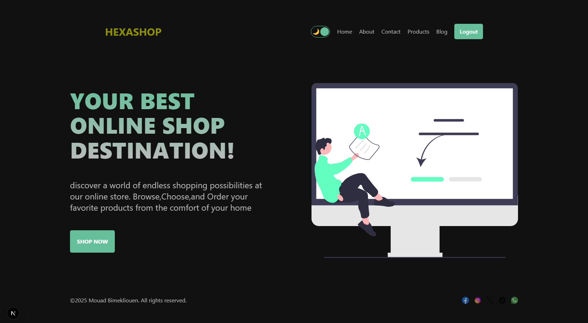
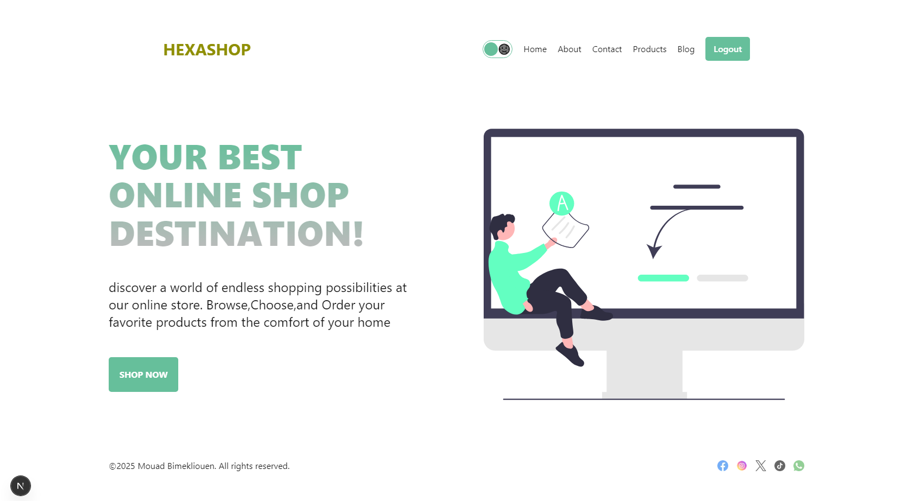
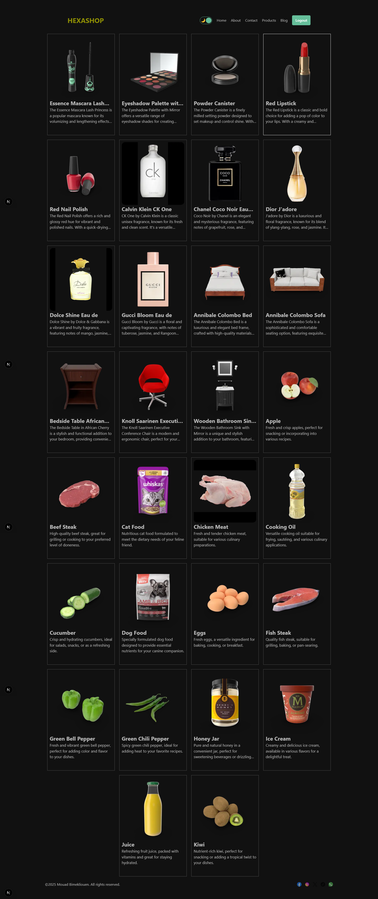

## Getting Startet
First this is just my firt project with next js:

## IF YOU WANT TO TEST
```bash
npm clone https://github.com/mouadbimk/Ecom-nextjs
# and
npm init
# and
npm run dev

Open [http://localhost:3000](http://localhost:3000) with your browser to see the result.
```
## Home Page Dark

## Home Page Light

## Products Page

